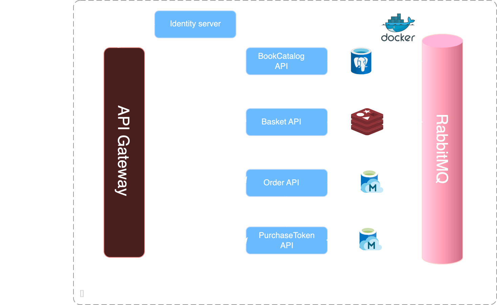

# BookStoreSolution

### Architecture



### Book Order Process Flow


1) The user makes request to book catalog api to fetch books that have stock.
2) The user adds books to cart by making request to the basket api.
3) Once the user has finshed shopping a checkout request is sent to the basket api. The basket api.
publishes a basketcheckout event to the rabbitMQ event bus. The order api consumes the basketcheckout event received on basketcheckout-queue and creates an order with pending order status.
4) The user makes a payment authorization request on the pending order on the authorize endpoint of the order api.
5) The order api makes rpc call to the purchase token api to authorize order. If the authorize call is unsuccessful the order status is changed to failed and response is returned to the user.
6) If the payment authorization request was successful the order api publishes an orderstatusconfirmed event to the orderstatusconfirmed-queue in the eventbus to be consumed by the bookcatalog api in order to reduce the stock of books purchased in the order.
7) The order api returns an order confirmed response to the user to complete the process.

### Services

#### BookCatalog API
* Houses the book stocks
* Consumes event from event bus to reduce stocks on order confirmed
* Uses sql relational database postgre inorder to maintain acid properties since users will accessing same stock of books

#### Basket API
* Houses items in the user cart while shopping
* Publishes basket checkout event to the event bus to create an order
* Uses redis key/value pair database as data in this service is short lived and deleted when the user checks out.

#### Order API
* Houses book orders
* consumes basketcheckout event from the event bus to create an order in pending status
* Has Grpc connection as client to PurchaseToken API for payment authorization for an order.
* Publishes an orderstatusconfirmed event to the event bus
* Mongo db database is used for storing orders

#### Purchase API
* Houses book purchase token for users
* can check balance, deposit and withdraw book purchase token for users
* Performs payment authorization for order as a Grpc server
* Mongo db database is used for storing book purchase tokens

#### Identity Server
* Houses information for the use
* handles authentication and authorization of users on other services
* Use OAuth2 implicit flow to authenticate users on the api swagger pages
* A reference type token has been used and validated with the intropect endpoint
* Two scopes Gatewayscope and API has been been created to enable service authentication
* This service is an adaption of the IdentityServer4 https://identityserver4.readthedocs.io/en/latest/

### RUN PROJECT

You will need the following tools:

* Visual Studio 2022
* Visual Studio code
* .Net Core 6 or later
* Docker Desktop

#### Installing

Follow these steps to get your development environment set up: (Before Run Start the Docker Desktop)

1. Clone the repository
2. Once Docker for Windows is installed, go to the Settings > Advanced option, from the Docker icon in the system tray, to configure the minimum amount of memory and CPU like so:
* Memory: 4 GB
* CPU: 2
3. At the root directory which include docker-compose.yml files, run below command:

```
docker-compose -f docker-compose.yml -f docker-compose.override.yml up -d
```

4. Wait for docker compose all microservices. That’s it! (some microservices need extra time to work so please wait if not worked in first shut)

5. You can launch microservices as below urls:

* BookCatalog API -> https://localhost:5046/swagger/index.html

* Basket API -> https://localhost:5047/swagger/index.html

* Order API -> https://localhost:5048/swagger/index.html

* PurchaseToken API -> https://localhost:5045/swagger/index.html

* Identity Server -> https://localhost:5044

* Rabbit Management Dashboard -> http://host.docker.internal:15672 -- guest/guest

### Future Improvements

Due to the time constraints the following futures were not added

* API Gateway implementation here Ocelet apigateway or APIM (Azure API Management) or AWS API Gateway will be suitable

* Service monitoring solution for logging such Elastic search with Kibana will be nice for centralized logging

* Azure blob storage or S3 integration for saving book images


